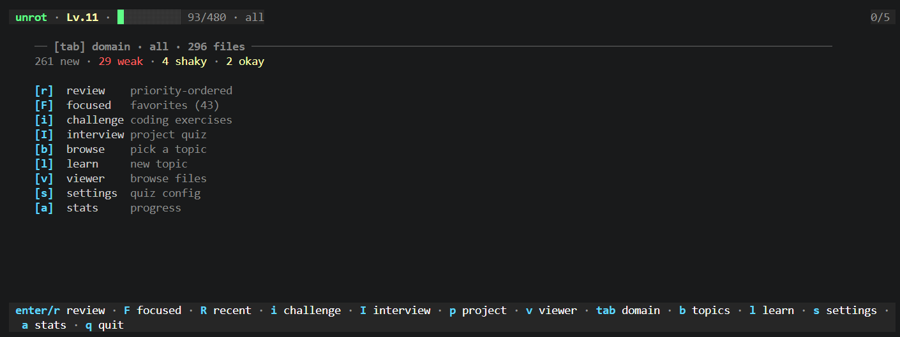

# unrot

Terminal study app for reviewing your own knowledge files with Ollama-generated questions. `unrot` mixes confidence tracking, guided review, chat-assisted learning, and coding challenges without forcing your notes into a separate platform.



**Live demo:** [froesch.dev](https://froesch.dev)

## Release Status

Developed for WSL2/Linux first. Cross-platform testing and bug fixing for macOS and native Windows are still in progress.

Linux, WSL2, and macOS are the primary targets today. Windows binaries and installer entrypoints are available, but native Windows should still be treated as experimental.

## Install

`unrot` depends on a running [Ollama](https://ollama.com) daemon. The default model is `qwen2.5:7b`.

Quick install:

```bash
ollama pull qwen2.5:7b
curl -fsSL https://raw.githubusercontent.com/LFroesch/unrot/main/install.sh | bash
```

Experimental native Windows install:

```powershell
irm https://raw.githubusercontent.com/LFroesch/unrot/main/install.ps1 | iex
```

Direct installers: [`install.sh`](https://raw.githubusercontent.com/LFroesch/unrot/main/install.sh), [`install.ps1`](https://raw.githubusercontent.com/LFroesch/unrot/main/install.ps1)

If you cloned the repo already:

```powershell
./install.ps1
```

```bat
install.cmd
```

Other options:

```bash
go install github.com/LFroesch/unrot@latest
make install
```

Run:

```bash
unrot
unrot docker
unrot -n 5
unrot --brain ~/notes
```

## What It Does

- review markdown knowledge files by domain
- generate and grade questions with Ollama
- track confidence, streaks, recent activity, and achievements
- chat against the current topic while you study
- generate new notes from the Learn flow
- run standalone coding challenges
- scan real projects into knowledge files for later review

## Knowledge Layout

Point `unrot` at the root of your notes collection, the parent of `knowledge/`:

```bash
export UNROT_NOTES="$HOME/path/to/notes"
```

Files are expected under:

```text
<notes-root>/knowledge/<domain>/<slug>.md
```

`SECOND_BRAIN` still works as a legacy alias. You can also set the path from inside the app and let it persist in state.

Knowledge files can also declare prerequisites in `## Connections` using lines like `- requires: go/goroutines`, which `unrot` uses to pull weaker prerequisite topics forward during review.

## Session Flow

1. Open the dashboard
2. Start a review or browse topics
3. Read the lesson content
4. Answer the question
5. Rate your confidence from `1` to `5`

Available screens include Dashboard, Topic List, Quiz, Learn, Challenge, Project Scan, Recent, Stats, and Settings.

## Settings and State

Environment variables:

| Variable | Purpose |
|----------|---------|
| `UNROT_NOTES` | notes root |
| `SECOND_BRAIN` | legacy alias for `UNROT_NOTES` |
| `OLLAMA_HOST` | Ollama endpoint |
| `UNROT_MODEL` | model override |
| `UNROT_DAILY_GOAL` | daily question target |

State is stored at `~/.local/share/unrot/state.json`. Session reports can be exported under `~/.local/share/unrot/reports/`.

## Controls

| Key | Action |
|-----|--------|
| `r` | Smart review |
| `F` | Favorites-only review |
| `b` | Browse topics |
| `l` | Learn mode |
| `i` | Challenge mode |
| `p` | Project scan |
| `s` | Settings |
| `a` | Stats and achievements |
| `/` | Search topics |
| `f` | Toggle favorite |
| `ctrl+r` | Regenerate question |
| `1-5` | Rate confidence |
| `c` | Open chat overlay |
| `k` | Open knowledge overlay |
| `n` | Open notes overlay |
| `?` | Help |
| `q` | Quit from dashboard |

## License

[AGPL-3.0](LICENSE)
